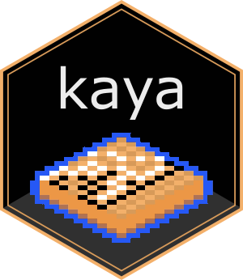

# **Kaya: An R Package for SGF Processing and Go Game Analysis**

**Kaya** is an R package designed for **parsing, validating, analyzing, and visualizing** Go game records stored in **Smart Game Format (SGF)**. It provides a structured approach to **game rule enforcement, board transformations, pattern analysis, and visualization**.

## **License**
This project is licensed under the MIT License. See the `LICENSE` file for details.
